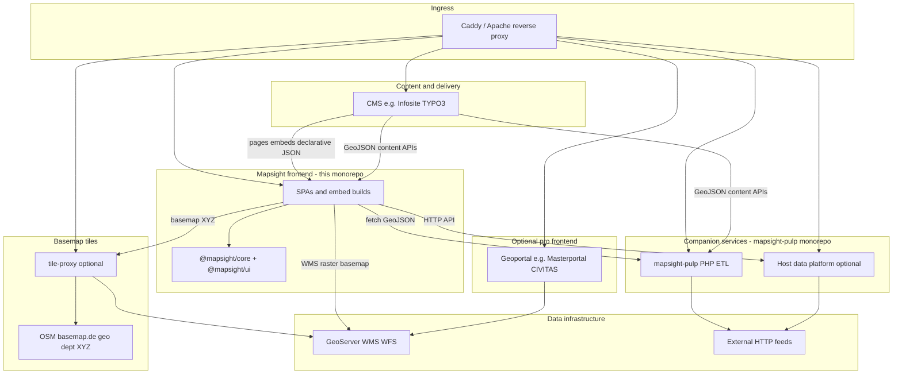

# Mapsight ecosystem

Mapsight is an **embed-first GIS frontend framework** published from this monorepo. Production deployments often combine
it with a **host CMS**, optional **data services**, and **OGC infrastructure** maintained by the host organization.

For _who_ needs _what kind of map_ (communicative vs geoportal vs GIS back-office),
see [GIS stack choices](../ecosystem/GIS_STACK_CHOICES.md).

---

## Technical deployment stack

Typical **municipal or regional** deployment (many components are optional):

The **CMS** is both a **delivery channel** and often a **content source**: it hosts Mapsight embeds (HTML snippets or
CMS integration packages), drives the UI through **declarative JSON**, and can supply GeoJSON directly or via pulp. That
supports **multi-page applications** where Mapsight components transition fluidly between site pages without treating
each map as an isolated iframe app.

**Smaller hosts** (association site, campaign microsite) often use only **embed builds + `@mapsight/*` packages +
GeoJSON** and a direct or host-provided basemap URL — no geoportal, no pulp, no platform.

---

## Repositories

### Public

| Repository                                                                 | Role                                                                                                         | Tech                           |
| -------------------------------------------------------------------------- | ------------------------------------------------------------------------------------------------------------ | ------------------------------ |
| **[mapsight](https://github.com/open-mapsight/mapsight)** (this monorepo)  | GIS **frontend framework** — `@mapsight/core`, `@mapsight/ui`, styles, count-aggregator packages             | React, Redux, OpenLayers, pnpm |
| **[mapsight-pulp](https://github.com/open-mapsight/mapsight-pulp)**        | **Geo/traffic ETL** — stream-based PHP transforms (Concert, TIC, KML→GeoJSON, etc.)                          | PHP, Composer                  |
| **[tile-proxy](https://github.com/open-mapsight/mapsight-pulp)**           | **Basemap tile proxy** — cache and transform XYZ tiles in front of OSM, basemap.de, municipal tile endpoints | PHP, Composer                  |

### Host-operated (not in open-mapsight org today)

| Component                    | Typical role                                                                          |
| ---------------------------- | ------------------------------------------------------------------------------------- |
| **CMS**                      | Pages, embed hosting, declarative JSON config, GeoJSON or APIs (directly or via pulp) |
| **GeoServer** (or similar)   | OGC WMS/WFS; official basemap rasters and thematic layers                             |
| **Data platform**            | Time-series imports, station APIs (e.g. count-aggregator backends)                    |
| **CMS integration packages** | Deeper CMS wiring (some packages planned for open source)                             |

---

## Basemap and tile sources

Mapsight **does not ship a basemap**. The host configures basemap layers in embed or app config (OpenLayers XYZ, WMS,
etc.).

| Pattern                                                             | Description                                                                                             | When to use                                                                                                                                                                      |
| ------------------------------------------------------------------- | ------------------------------------------------------------------------------------------------------- | -------------------------------------------------------------------------------------------------------------------------------------------------------------------------------- |
| **A. [tile-proxy](https://github.com/open-mapsight/mapsight-pulp)** | Service at e.g. `/tiles/{prefix}/{z}/{x}/{y}.png` — caches and optionally transforms upstream XYZ tiles | **Common in production** — same-origin URL, caching, branding/desaturation, reduced direct browser load on third parties. See [integration guide](../integration/TILE_PROXY.md). |
| **B. Direct XYZ**                                                   | Browser loads tiles from public URL in config                                                           | Development, low traffic; respect [OSM](https://www.openstreetmap.org/copyright) / [basemap.de](https://basemap.de) **terms, attribution, and rate limits**                      |
| **C. GeoServer WMS**                                                | Raster basemap as OGC layer from municipal GeoServer                                                    | When the geo department already publishes an official city basemap                                                                                                               |
| **D. Municipal tile server**                                        | Internal XYZ/WMTS from GIS infrastructure, often **fronted by A**                                        | Survey-aligned basemap; proxy adds cache and stable public URL                                                                                                                   |

**Basemap vs overlays:** The basemap provides **context** (streets, topography). **Thematic layers** (GeoJSON, WMS
overlays, vector features) sit on top. GeoServer often serves both; configure them as separate layer entries.

**Privacy:** For public-facing municipal sites, prefer **self-hosted or proxied** basemaps over sending every visitor’s
tile requests to proprietary map SaaS APIs. See [Principles → UX](PRINCIPLES.md#ux-goals).

---

## Data flow summary

| Source               | Consumed by Mapsight as     | Typical origin                                                    |
| -------------------- | --------------------------- | ----------------------------------------------------------------- |
| GeoJSON files / APIs | Feature layers              | CMS, pulp, platform API, static files                             |
| WMS / WFS            | Raster or vector map layers | GeoServer                                                         |
| XYZ / WMTS           | Basemap                     | tile-proxy, OSM, basemap.de, municipal tiles                      |
| Embed config JSON    | Full map/list/filter state  | CMS snippet, SPA bootstrap, SSR hydration; drives MPA transitions |

Mapsight **consumes** published geodata; it does **not** replace GeoServer administration, desktop GIS, or ETL
back-office tools.

---

## Related docs

- [Principles](PRINCIPLES.md) — scope, composable UI, non-goals
- [Current vs target](CURRENT_VS_TARGET.md) — implementation status
- [@mapsight/core → Redux architecture](../../packages/core/docs/REDUX_ARCHITECTURE.md) — declarative GIS runtime
- [mapsight-pulp](https://github.com/open-mapsight/mapsight-pulp) — PHP companion monorepo
- [tile-proxy](https://github.com/open-mapsight/mapsight-pulp) — basemap
  proxy; [integration guide](../integration/TILE_PROXY.md)

- [GIS stack choices](../ecosystem/GIS_STACK_CHOICES.md) — stakeholders and product channels
- [Positioning](../ecosystem/POSITIONING.md) — Masterportal / CIVITAS summary
- [Integration overview](../integration/OVERVIEW.md)
