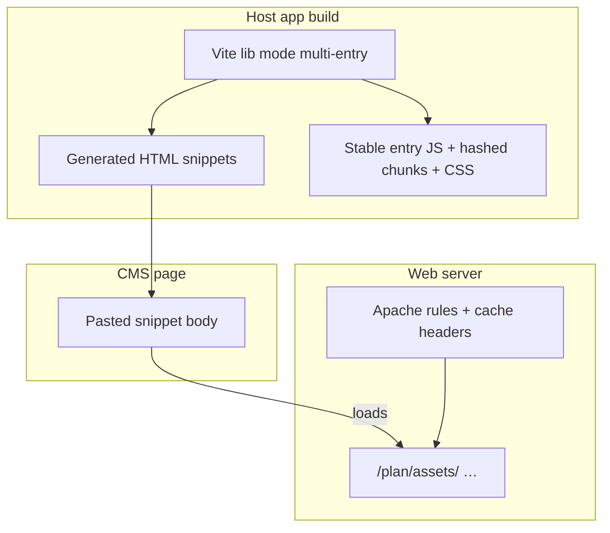

# CMS and PHP snippet embed

Generic pattern for embedding Mapsight in **PHP-backed CMS pages** or static Apache/nginx hosts. Applies to TYPO3 and
similar PHP CMS workflows; Java-based Infosite adds a module layer — see [CMS_INFOSITE.md](CMS_INFOSITE.md).

> **Example paths:** `/mapsight-assets/`, `simpleMap.js`, and `mapsight-embed-demo` are **host-chosen examples** from [
`starters/mapsight-host-starter`](../../starters/mapsight-host-starter). Your deploy prefix, preset names, and container
> IDs are defined by your host app build.

---

## When to use this pattern

- Editorial staff paste HTML into CMS pages
- Host owns the page shell (header, footer, navigation)
- One shared Mapsight build serves many topical embeds plus optional full-page map routes
- Config varies per placement without rebuilding JavaScript

This is Mapsight’s **primary production integration shape** for communicative municipal maps.

---

## Architecture



---

## Core principles

### 1. Config lives in the snippet, not in the build

Each CMS placement passes config inline in an ES module `<script>` block. **Do not bake per-config bundles** — one
shared build serves all placements.

```html

<link rel="stylesheet" href="/mapsight-assets/assets/mapsight.css"/>

<div id="mapsight-embed-demo" class="mapsight-embed"></div>

<script type="module">
	import browserEmbed from "/mapsight-assets/assets/embed.js";
	import {simpleMap} from "/mapsight-assets/assets/simpleMap.js";

	document.addEventListener("DOMContentLoaded", () => {
		const element = document.getElementById("mapsight-embed-demo");
		if (!(element instanceof HTMLElement)) {
			throw new Error("Mapsight embed container not found");
		}

		browserEmbed(
			element,
			simpleMap({
				imagesUrl: "/mapsight-assets/img/",
				featureSourceUrl: "/mapsight-assets/data/demo.geojson",
				startCoordinates: [10.5, 52.2],
			}),
		);
	});
</script>
```

### 2. Stable wrapper filenames for CMS imports

Snippet `<script>` tags import **stable** filenames (revalidated on deploy):

| File           | Purpose                                                    |
|----------------|------------------------------------------------------------ |
| `embed.js`     | Stable wrapper for the hashed `browserEmbed` runtime entry |
| `mapsight.css` | Stable wrapper for the hashed stylesheet                   |
| `<preset>.js`  | Stable wrappers per embed type (`simpleMap.js`, …)         |

Shared dependencies (OpenLayers, React/Redux, vector styles) land in **content-hashed chunks** safe for long cache.
If a stable wrapper should support default imports, list its basename in `defaultEntryExports`; otherwise wrappers only re-export named exports.

### 3. Asset paths are configurable at the call site

Icon and image URLs (`imagesUrl`) must be set in the snippet — not baked at build time — so the same build works across
environments.

### 4. One lib build, multiple entry stubs

All embed types share hashed chunks. Avoid separate per-type lib builds that duplicate OpenLayers and React.

---

### 5. HTML markers are the snippet source of truth

Host apps mark paste-ready regions in HTML with `<!-- mapsight:snippet:start/end -->`. The build extracts them to
`dist/snippets/*.html` — no parallel TypeScript snippet templates.

Use **production deploy paths** in the marked region (`/mapsight-assets/assets/…`, not dev-only `/img/` shortcuts).
During local dev, `@mapsight/vite-host-embed` aliases those URLs to `entries/*.ts` with HMR.

Optional inline hints for CMS editors (kept in built snippets; stripped in dev so Vite can parse inline scripts):

```html
imagesUrl: "/mapsight-assets/img/",
<!-- mapsight:cms:replace imagesUrl … -->
```

---

## Build pipeline (host app)

Typical steps in a host app that ships CMS assets:

1. **Vite lib mode** — multi-entry build (`embed.js`, preset stubs) with `minifyInternalExports: false` so named exports
   survive minification.
2. **`@mapsight/vite-host-embed`** — `mapsightHostEmbedPlugin` in embed build mode: copy traffic-style icons/data,
   hash the JS/CSS entry assets, write stable JS/CSS wrappers, rewrite vector-style CSS `url()` paths, extract `snippetSources` → `dist/snippets/`, write
   `.htaccess`. UI chrome icons ship in `assets/` via the Vite CSS pipeline.
3. **Local dev** — `mapsightHostEmbedDevPlugin` so `index.html` uses the same import paths as production snippets.
4. **Upload** — rsync `dist/mapsight-assets/` to web root (e.g. `/mapsight-assets/`).

Reference implementation: [`starters/mapsight-host-starter`](../../starters/mapsight-host-starter) and [
`@mapsight/vite-host-embed`](../../packages/vite-host-embed/README.md).

**Production lib mode note:** Vite does not auto-replace `process.env.NODE_ENV` in lib builds. Pin `NODE_ENV` via
explicit `define` or you may see `ReferenceError: process is not defined` in the browser.

---

## Deploy layout

After build, a typical tree:

```
/mapsight-assets/
├── assets/
│   ├── embed.js                 ← stable wrapper for browserEmbed
│   ├── embed-<hash>.js          ← long-cache browserEmbed entry
│   ├── simpleMap.js             ← stable wrapper for preset stub
│   ├── simpleMap-<hash>.js      ← long-cache preset stub
│   ├── mapsight.css             ← stable wrapper importing the hashed app CSS
│   ├── mapsight-host-<hash>.css ← long-cache app stylesheet
│   ├── ol-<hash>.js             ← long-cache chunk
│   └── react-redux-<hash>.js
├── data/                     ← example GeoJSON
├── img/                      ← traffic-style icons, sprites
└── .htaccess                 ← cache + static passthrough
```

Paste-ready HTML is written beside the deploy tree at `dist/snippets/` (not uploaded). See `dist/snippets/README.md`
after build.

**No `index.html` for embed-only routes** — the CMS owns the page shell. Full-page map experiences paste snippet body
into the CMS page template.

---

## Caching strategy

| Files                                    | Cache-Control                 | Rationale                                  |
|------------------------------------------|-------------------------------|-------------------------------------------- |
| `*-hash.js`, `*-hash.css`                | `immutable, max-age=31536000` | Content-addressed                          |
| `embed.js`, preset stubs, `mapsight.css` | `no-cache`                    | Tiny stable wrappers; revalidate on deploy |

`.htaccess` should passthrough `/assets/`, `/img/`, and `/data/` without rewriting to PHP.

---

## CSS integration

Styles are **not** auto-injected in Vite lib mode:

1. Snippet includes `<link rel="stylesheet" href="/mapsight-assets/assets/mapsight.css">`.
2. Host may add page-specific `<style>` for min-height, CMS layout, or icon overrides.
3. For host-native theming, load host theme CSS before or after Mapsight CSS and use CSS variables / scoped wrappers.
   See [Principles](../architecture/PRINCIPLES.md).

---

## Data sources

Embed config references GeoJSON URLs. Sources may be:

- CMS-published static files
- [mapsight-pulp](PULP.md) static GeoJSON output (scheduled jobs)
- Optional [platform API](DATA_BACKEND.md) for time-series features

Basemap tiles are configured separately (direct XYZ, municipal tile endpoint, or [tile-proxy](TILE_PROXY.md)).
See [Ecosystem § basemaps](../architecture/ECOSYSTEM.md).

---

## Optional SSR

For faster first paint, a PHP controller can POST embed options to a small Node render service and inject HTML +
`data-dehydrated-state`. **Must fall back** to client-only embed when SSR fails.
See [SSR_HYDRATION.md](SSR_HYDRATION.md).

---

## Adding a new embed type

1. Implement preset factory in host app source.
2. Add thin `entries/<type>.ts` re-export for lib entry.
3. Register entry in Vite lib config (`HOST_EMBED_TYPE_ENTRIES`).
4. Add or extend a marked HTML example (`embed-*.html` or `index.html`) and list it in `snippetSources`.
5. Rebuild, verify named exports in output stubs, deploy assets + updated snippets.

---

## Checklist — for IT / integrators

- [ ] Stable wrapper filenames documented for CMS editors
- [ ] Snippets use inline config — no per-page JS rebuild
- [ ] `imagesUrl` and GeoJSON URLs correct for target environment
- [ ] Stylesheet linked explicitly
- [ ] Cache headers split hashed vs stable assets
- [ ] SSR fallback tested if using hydration
- [ ] Reference snippet copied from current build (`dist/snippets/*.html`)

## Checklist — for CMS editors

See [CMS_EDITORS.md](CMS_EDITORS.md) — safe vs forbidden edits, HTML filters, when to call IT.

---

## Related

- [Integration overview](OVERVIEW.md)
- [Config reference](CONFIG_REFERENCE.md)
- [Host embed starter](../../starters/mapsight-host-starter)
- [`@mapsight/vite-host-embed`](../../packages/vite-host-embed/README.md)
- [SSR hydration](SSR_HYDRATION.md)
- [Pulp](PULP.md)
- [Decision 006 — SSR goal](../architecture/decisions/006-ssr-state-hydration-goal.md)
