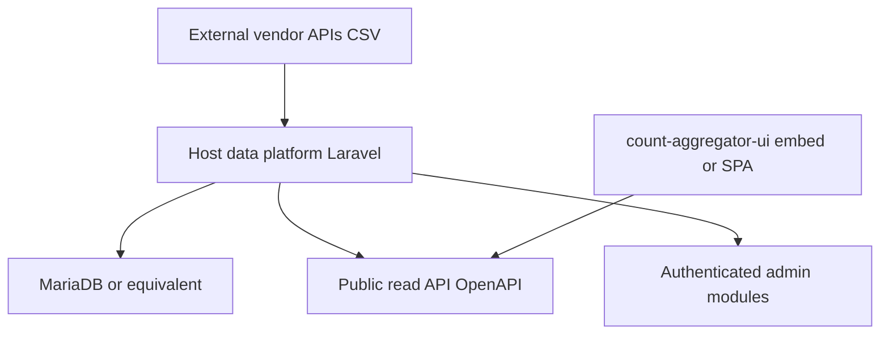

# Optional data platform pattern

Some deployments need more than CMS-published GeoJSON and [mapsight-pulp](PULP.md) transforms: **structured imports**, a **station model**, time-series storage, and a **public read API** for Count Aggregator and similar dashboards.

Mapsight monorepo packages (`@mapsight/count-aggregator-api`, `@mapsight/count-aggregator-ui`) consume such an API — but the **platform application itself is host-operated** and not part of the open-source monorepo today.

---

## When you need a data platform

| Signal                                                            | CMS + pulp | Platform |
| ----------------------------------------------------------------- | ---------- | -------- |
| Bicycle/pedestrian/traffic counter time series                    | Limited    | ✓        |
| Scheduled imports from vendor APIs (Niotix, EcoCounter, OCPI2, …) | —          | ✓        |
| Admin UI for stations, presets, data quality                      | —          | ✓        |
| OpenAPI-documented public GeoJSON + values API                    | Partial    | ✓        |
| Meilisearch or similar search over station metadata               | —          | ✓        |

If thematic maps only need static or lightly transformed GeoJSON, **start without a platform**.

---

## Architecture (generic)

Typical stack (reference deployments): **Laravel** backend, **React** admin modules, relational DB, optional Meilisearch. Exact versions and modules vary by host.

---

## Mapsight monorepo touchpoints

| Package                          | Role                                                  |
| -------------------------------- | ----------------------------------------------------- |
| `@mapsight/count-aggregator-api` | TypeScript client + types aligned to platform OpenAPI |
| `@mapsight/count-aggregator-ui`  | React dashboard widgets (wizard, charts, map layers)  |
| Host CMS/SPA app                 | Builds embed or `/count-aggregator/` SPA shell        |

The platform exposes routes such as:

- `GET /{type}/stations`, `GET /stations.geojson`
- `GET /{type}/values/{from}/{to}/{resolution}`
- `GET /{type}/last-values/{resolution}`
- Published **OpenAPI** at `/public/count-aggregator/openapi.json` (path prefix varies by host)

Configure the API base URL in host app env — never hardcode customer domains in public package docs.

---

## Deployment pattern

1. Deploy platform behind same ingress as Mapsight apps (common path prefix e.g. `/msp/`).
2. Run import schedulers and migrations on the host.
3. Publish **public** API routes separately from authenticated admin routes.
4. Build count-aggregator UI into CMS snippet or SPA; point `@mapsight/count-aggregator-api` at public base URL.

Showcase app includes a **mock API** for local development without a live platform.

---

## Licensing and visibility

The reference platform is **proprietary today** (may open-source later). That affects:

- opencode.de / CIVITAS component listings
- What can be copied into public documentation vs maintainer-only notes

Public docs describe the **pattern**; deployment-specific URLs, customer names, and admin modules stay in private maintainer docs.

---

## Open questions

- [ ] Public documentation for self-hosted platform setup when/if repo opens
- [ ] Generic docker-compose example without customer-specific config
- [ ] Alignment of platform OpenAPI with `@mapsight/count-aggregator-api` release cadence

---

## Related

- [PULP.md](PULP.md)
- [Integration overview](OVERVIEW.md)
- [Ecosystem](../architecture/ECOSYSTEM.md)
- `@mapsight/count-aggregator-ui` package README and PLAN
