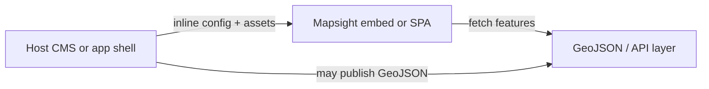
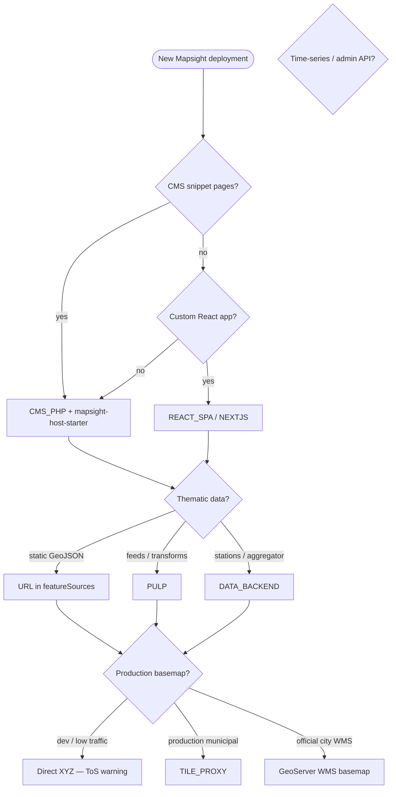
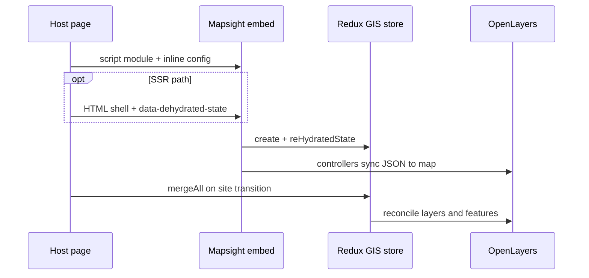

# Integration overview

Mapsight is npm packages (`@mapsight/core`, `@mapsight/ui`, and domain add-ons) plus **embed contracts** that host
applications load into their pages — not a monolithic map portal.

For _who_ needs _what kind of map_, see [GIS stack choices](../ecosystem/GIS_STACK_CHOICES.md).

---

## Three layers

Most production deployments combine three layers. Each can be minimal or full-featured:

| Layer                  | Role                                            | Typical technology                                                            | Mapsight touchpoint                            |
|------------------------|-------------------------------------------------|-------------------------------------------------------------------------------|------------------------------------------------|
| **Content / delivery** | Page shell, editorial workflow, embed placement | CMS (PHP, Java, or static site generator)                                     | HTML snippets, inline config, optional SSR     |
| **Data preparation**   | Fetch, transform, serve GeoJSON or APIs         | CMS APIs, [mapsight-pulp](PULP.md), optional [data platform](DATA_BACKEND.md) | `featureSources`, HTTP loaders, TanStack Query |
| **Mapsight frontend**  | Map, list, filters, theming                     | This monorepo — embed or SPA                                                  | `create()` / `browserEmbed`, Redux GIS store   |

**Smaller hosts** often skip the middle layer: CMS or a static file server publishes GeoJSON directly; the embed fetches
it.

---

## Integrator decision flow

---

## Embed lifecycle

The primary integration path for communicative maps:

1. **Host page** includes stylesheet link, container element, and inline ES module script (or SSR-injected markup).
2. **Script** imports `browserEmbed` from stable `embed.js` and a preset factory, resolves the container element, then
   calls `browserEmbed(container, presetOptions)`.
3. **`browserEmbed`** (`@mapsight/ui/embed/browser`) reads optional `data-dehydrated-state` from the container, creates
   the Redux GIS store via `create()`, and renders OpenLayers + React UI.
4. **Runtime** — host or router plugins call path actions (`mergeAll`, `resetMapsightCore`) on site transitions without
   full page reload where configured.

See [`packages/ui/src/js/embed/browser.ts`](../../packages/ui/src/js/embed/browser.ts) for the hydration hook. Reference
host embed build: [`starters/mapsight-host-starter`](../../starters/mapsight-host-starter).

### Embed API

| API                                                  | Export                       | Role                                        |
|------------------------------------------------------|------------------------------|---------------------------------------------|
| `browserEmbed(container, options)`                   | `@mapsight/ui/embed/browser` | CMS embed bootstrap; optional SSR hydration |
| `create(container, styleFunction, config, options?)` | `@mapsight/ui`               | Direct mount — SPAs and custom React hosts  |

Preset factories (e.g. `simpleMap()`) return the `options` object for `browserEmbed`:
`{ styleFunction, baseMapsightConfig, createOptions }`. The CMS `embed.js` lib entry re-exports `browserEmbed` and
imports stylesheet side effects.

Details: [Config reference](CONFIG_REFERENCE.md).

---

## Integration targets

| Host pattern               | Reference in monorepo                                                            | Guide                                       |
|----------------------------|----------------------------------------------------------------------------------|---------------------------------------------|
| PHP / generic CMS snippets | [`starters/mapsight-host-starter`](../../starters/mapsight-host-starter)         | [CMS_PHP.md](CMS_PHP.md)                    |
| Java CMS (Infosite)        | Pending Java module research                                                     | [CMS_INFOSITE.md](CMS_INFOSITE.md) **stub** |
| Vite + React Router SPA    | [`starters/mapsight-vite-spa-starter`](../../starters/mapsight-vite-spa-starter) | [REACT_SPA.md](REACT_SPA.md)                |
| Next.js App Router         | [`starters/mapsight-next-starter`](../../starters/mapsight-next-starter)         | [NEXTJS.md](NEXTJS.md)                      |
| TanStack Router            | Document pattern only                                                            | Same embed + `resetMapsightCore` as SPA     |

**TYPO3:** follows the same mental model as [CMS_PHP.md](CMS_PHP.md) (PHP CMS + snippet embed). A dedicated TYPO3
example is pending maintainer input.

---

## Data backends

Choose based on complexity — not every deployment needs all three:

| Need                                                                | Option                                                    | Guide                              |
|---------------------------------------------------------------------|-----------------------------------------------------------|------------------------------------|
| Static or CMS-published GeoJSON                                     | Direct URL in embed config                                | [CMS_PHP.md](CMS_PHP.md)           |
| Scheduled transforms → static GeoJSON (feeds, KML, domain handlers) | mapsight-pulp (cron/systemd)                              | [PULP.md](PULP.md)                 |
| Same-origin basemap tiles (cache, merge, branding)                  | [tile-proxy](https://github.com/open-mapsight/tile-proxy) | [TILE_PROXY.md](TILE_PROXY.md)     |
| Time-series stations, Count Aggregator API, admin imports           | Host-operated Laravel platform                            | [DATA_BACKEND.md](DATA_BACKEND.md) |

See [Ecosystem](../architecture/ECOSYSTEM.md) for how these fit in a full municipal stack.

---

## SSR and hydration

Optional but valuable for CMS pages: server renders HTML shell + serializable GIS state; client rehydrates via
`data-dehydrated-state`. **Graceful fallback** to client-only embed when SSR is unavailable is required for production
CMS hosts.

Details: [SSR_HYDRATION.md](SSR_HYDRATION.md) · [Decision 006](../architecture/decisions/006-ssr-state-hydration-goal.md)

---

## Cross-cutting patterns

### Config in the page, not in the build

One shared JS/CSS build serves many CMS placements. Each placement passes **inline JSON config** in the snippet — do not
bake per-page bundles.

### Host-native theming

Styles should blend into the surrounding site. Link host CSS variables or theme partials alongside Mapsight assets.
See [Principles](../architecture/PRINCIPLES.md)
and [Decision 007](../architecture/decisions/007-ui-styling-strategy.md).

### Form ↔ map sync (preset hooks)

CMS forms can drive map draw interactions via `presetHook` + `observeState` — e.g. a location picker field updates a
point on the map. Keep presets host-agnostic; no single CMS owns this API.

### Site transitions

Multi-page CMS sites can keep GIS state coherent using router plugins and `mergeAll` / `resetMapsightCore` when
navigating between pages that share Mapsight embeds.

---

## What Mapsight does not replace

- **Geoportals** (Masterportal, CIVITAS geoportal slot) — adjacent product channel;
  see [GIS stack choices](../ecosystem/GIS_STACK_CHOICES.md)
- **GeoServer / OGC infrastructure** — Mapsight **consumes** WMS/WFS/GeoJSON; geo departments operate the server
- **CMS itself** — Mapsight embeds into editorial workflows; it is not a content management system

---

## Related

- [Getting started](../getting-started.md)
- [Config reference](CONFIG_REFERENCE.md)
- [Ecosystem](../architecture/ECOSYSTEM.md) — deployment stack, repos, basemaps
- [Principles](../architecture/PRINCIPLES.md) — scope and UX goals
- [Redux architecture](../../packages/core/docs/REDUX_ARCHITECTURE.md) — runtime model

### For contributors

- [Development standards](../development/STANDARDS.md)
- [Contributing](../development/CONTRIBUTING.md)
