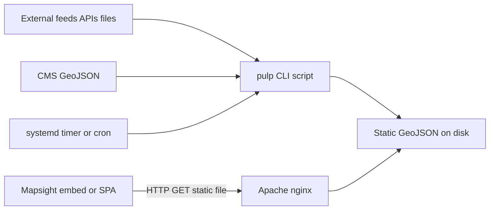

# mapsight-pulp integration

[mapsight-pulp](https://github.com/open-mapsight/mapsight-pulp) is a **lightweight PHP ETL library** for geo and traffic data —
not a full application backend. Mapsight frontends **fetch GeoJSON** from static files (or CMS URLs) that pulp produces
on a schedule.

---

## When to use pulp

| Scenario                                                  | CMS-only | Pulp | Platform |
| --------------------------------------------------------- | -------- | ---- | -------- |
| Static GeoJSON files edited in CMS                        | ✓        | —    | —        |
| Merge CMS GeoJSON + external HTTP feed                    | —        | ✓    | —        |
| Domain transforms (Concert, TIC, KML→GeoJSON, CSV)        | —        | ✓    | —        |
| Time-series stations, Count Aggregator API, admin imports | —        | —    | ✓        |

**Rule of thumb:** pulp when you need **fetch → transform → write** pipelines without standing up a database-backed API.
Use the optional [data platform](DATA_BACKEND.md) when you need structured imports, station models, and authenticated
admin.

---

## Architecture (recommended)

Pulp uses a **Gulp-inspired stream pipeline**: fetch handlers → transform handlers → **write** output. Domain logic
lives in Composer packages (`pulp-geojson`, `pulp-concert`, `pulp-tic`, `pulp-geocsv`, etc.).

---

## Deployment pattern

**Default (production):**

1. Install `mapsight/pulp` via Composer in a host directory.
2. Add **per-use-case CLI scripts** (e.g. `standplan.php`, `events.php`) that run the pipeline and **write GeoJSON to
   disk**.
3. Schedule with **systemd timer** or **cron** (interval depends on feed — minutes to daily).
4. Serve written files as **static assets** from Apache/nginx (same maps host or CMS path).
5. Reference the stable URL in Mapsight `featureSources` or loader config.

Benefits: predictable load, simple caching, no PHP worker per browser request, secrets stay off the request path.

**Avoid for production:** exposing pulp scripts directly as live HTTP endpoints that transform on every request. That
pattern was used only to stand up demos quickly — it adds latency, complicates caching, and runs ETL in the web tier.

---

## Mapsight frontend consumption

From the embed/SPA perspective, pulp output is ordinary **static GeoJSON over HTTP**:

- Configure URL in declarative Redux JSON / Zod-validated embed config
- Refresh when the scheduled job updates files (or on page load — no live ETL round-trip)
- Same-origin or CORS as for any static GeoJSON asset

Pulp does **not** run inside the browser or the Node monorepo build.

---

## Operations

| Concern      | Guidance                                                                              |
| ------------ | ------------------------------------------------------------------------------------- |
| Scheduling   | systemd timer or cron; monitor job success/failure                                    |
| Output paths | Stable URLs for embed config; atomic writes (temp file + rename) where possible       |
| Caching      | Long cache headers on versioned or timestamped files; shorter cache if URLs are fixed |
| Errors       | Failed jobs should alert ops; last good file often remains served                     |
| Secrets      | API keys only in server-side pulp config — never in embed JSON                        |

---

## CIVITAS note

Pulp fits as a **specialized transform job** in a CIVITAS stack — not a replacement for NiFi/Redpanda-style pipeline
engines. See the upstream [mapsight-pulp monorepo](https://github.com/open-mapsight/mapsight-pulp) for
`civitas-core-pulp-integration`.

---

## Repository and docs

- **GitHub:** [github.com/open-mapsight/mapsight-pulp](https://github.com/open-mapsight/mapsight-pulp)
- **Package:** Composer `mapsight/pulp`
- **License:** See upstream `LICENSE`

Monorepo packages do not wrap pulp — integration is **HTTP to static GeoJSON** at the deployment boundary.

---

## Related

- [TILE_PROXY.md](TILE_PROXY.md) — basemap tiles (companion PHP service)
- [DATA_BACKEND.md](DATA_BACKEND.md) — when CMS + pulp are not enough
- [Integration overview](OVERVIEW.md)
- [Ecosystem](../architecture/ECOSYSTEM.md)
- [Decision 003 — GeoJSON-first](../architecture/decisions/003-geojson-first-data-model.md)
