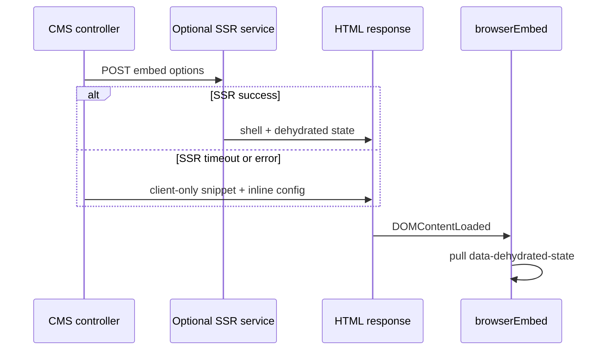

# SSR and state hydration

Communicative maps on CMS pages benefit from **first meaningful paint** — list and map markup visible before JavaScript executes — while preserving GIS state when the client bundle loads.

The hydration **contract** below is stable. Host wiring (PHP sidecar vs Next.js SSR) is still open — see [ADR 006](../architecture/decisions/006-ssr-state-hydration-goal.md).

---

## Hydration contract

Server (or build-time SSR) emits:

1. **HTML shell** — container markup the client will hydrate into
2. **Serializable GIS state** — JSON placed on the container as `data-dehydrated-state` (attribute name configurable)

Client [`browserEmbed`](../../packages/ui/src/js/embed/browser.ts) reads the attribute when `reHydratedState` is not passed explicitly, merges into create options, and runs the initial render.

```html
<div
	id="mapsight-embed-1"
	data-dehydrated-state='{"mapsightCore":{…},"app":{…}}'
></div>
```

Large GeoJSON payloads may **lazy-load after shell hydrate** — keep dehydrated state size-bounded.

---

## Graceful degradation (required)

Production CMS integrations **must work when SSR is down**:

1. Attempt SSR (e.g. POST options to render service with timeout and size cap).
2. On success — inject shell + dehydrated state; client bootstraps on `DOMContentLoaded`.
3. On failure — emit the **same embed markup** with inline JSON config only; optional HTML comment that SSR was skipped.

Pages must never hard-depend on SSR uptime. This pattern is proven in reference PHP CMS deployments.

---

## Implementation paths under evaluation

| Path                             | Fit                       | Notes                                             |
| -------------------------------- | ------------------------- | ------------------------------------------------- |
| **PHP → Node/Bun sidecar**       | Classic CMS hosts         | POST embed options; separate process ops overhead |
| **Next.js / TanStack Start SSR** | Modern React hosts        | See [NEXTJS.md](NEXTJS.md); evaluate per app      |
| **React Router framework SSR**   | SPA-first municipal sites | Middle ground                                     |
| **Client-only embed**            | Simplest ops              | Accept slower first paint — valid for many embeds |

Monorepo entry points today:

- Client: [`packages/ui/src/js/embed/browser.ts`](../../packages/ui/src/js/embed/browser.ts)
- Server: [`packages/ui/src/js/server-handler.js`](../../packages/ui/src/js/server-handler.js), [`packages/ui/src/js/embed/node.ts`](../../packages/ui/src/js/embed/node.ts)

**Not decided:** primary server runtime (Node LTS vs Bun), unified render API vs per-framework adapters.

---

## Sidecar integration recipe (PHP CMS)

When using a **PHP → Node/Bun sidecar** (see [CMS_PHP](CMS_PHP.md)), treat SSR as optional acceleration — client-only `browserEmbed` must remain the fallback.

### Request (CMS → sidecar)

POST JSON to an internal render endpoint (localhost or private network):

```json
{
	"preset": "simpleMap",
	"options": {
		"imagesUrl": "/mapsight-assets/img/",
		"featureSourceUrl": "/mapsight-assets/data/demo.geojson",
		"startCoordinates": [10.5, 52.2],
		"startZoom": 12
	}
}
```

Use a **size cap** (e.g. 256 KB–1 MB POST body) and **timeout** (2–5 s). Reject oversized payloads; fall back to client-only snippet.

### Response (sidecar → CMS)

Return HTML fragment for the container plus dehydrated state:

```html
<div
	id="mapsight-embed-demo"
	class="mapsight-embed"
	data-dehydrated-state='{"mapsightCore":{…},"app":{…}}'
></div>
```

Keep GeoJSON **out of** dehydrated state when possible — load via `featureSources` after hydrate.

### Client boot

Same snippet imports `browserEmbed` — it reads `data-dehydrated-state` automatically ([`browser.ts`](../../packages/ui/src/js/embed/browser.ts)).

### Security notes

| Topic      | Guidance                                                                                                     |
| ---------- | ------------------------------------------------------------------------------------------------------------ |
| Network    | Sidecar on loopback or internal VLAN — not public internet                                                   |
| Auth       | CMS→sidecar only; no anonymous public POST                                                                   |
| Secrets    | Never serialize API keys into dehydrated state                                                               |
| Rate limit | Per-page-type or per-IP limits on render endpoint                                                            |
| Fallback   | On timeout/error, emit standard client-only snippet ([graceful degradation](#graceful-degradation-required)) |

Monorepo server entry points: [`packages/ui/src/js/embed/node.ts`](../../packages/ui/src/js/embed/node.ts), [`packages/ui/src/js/server-handler.js`](../../packages/ui/src/js/server-handler.js).

---

## CMS embed flow (reference)



---

## SPA and Next hosts

- **React SPA:** usually client-only unless you add a custom SSR route; site transitions use `mergeAll` / `resetMapsightCore` instead of full SSR across pages.
- **Next.js:** App Router can SSR page shells; evaluate whether Mapsight render runs in RSC boundary or a dedicated API route. i18n remains host responsibility until [ADR 008](../architecture/decisions/008-i18n-approach.md) resolves.

---

## MPA transitions

SSR improves **first visit** to a page. When users navigate between CMS pages without full reload (rare) or between SPA routes, declarative JSON + path actions maintain coherence — SSR is not repeated on every client navigation.

---

## Related

- [ADR 006](../architecture/decisions/006-ssr-state-hydration-goal.md)
- [CMS_PHP.md](CMS_PHP.md)
- [NEXTJS.md](NEXTJS.md)
- [Principles](../architecture/PRINCIPLES.md)
