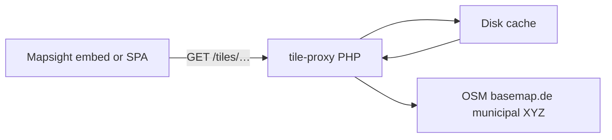

# tile-proxy integration

[tile-proxy](https://github.com/open-mapsight/tile-proxy) is a **PHP basemap tile proxy** — cache and optionally
transform XYZ tiles from upstream sources (OSM, basemap.de, municipal tile servers, GeoServer XYZ, etc.). Mapsight
embeds and SPAs use it as a **same-origin basemap URL** in OpenLayers layer config.

This is **not** an OGC request proxy (unlike Masterportal `proxy.cgi` for WMS/WFS). It is **XYZ basemap** focused.

See also [Ecosystem § basemaps](../architecture/ECOSYSTEM.md) for when to use tile-proxy vs direct XYZ vs GeoServer WMS.

> **Privacy:** The visitor’s browser requests basemap tiles **only from your host** (e.g. `/tiles/…`). Upstream tile
> servers (OSM, basemap.de, municipal endpoints) are contacted **by your server**, not by each visitor’s browser directly.
> See [Privacy data flows](PRIVACY_DATA_FLOWS.md).

---

## When to use tile-proxy

| Scenario                                    | Direct XYZ in embed                                            | tile-proxy            |
| ------------------------------------------- | -------------------------------------------------------------- | --------------------- |
| Local dev, low traffic                      | ✓                                                              | Optional              |
| Production municipal/regional host          | Risky (ToS, rate limits, third-party calls from every visitor) | **Recommended**       |
| Same-origin `/tiles/…` for privacy policy   | —                                                              | ✓                     |
| Cache + reduce load on OSM/third parties    | —                                                              | ✓                     |
| Desaturated/branded basemap (`colorFilter`) | —                                                              | ✓                     |
| Merge municipal tiles over OSM              | —                                                              | ✓ (`merge` op)        |
| Hide upstream credentials                   | —                                                              | ✓ (server-side fetch) |

Mapsight **does not ship a basemap** — configure the basemap layer URL in embed or app JSON to point at your proxy path.

---

## Architecture



1. Browser requests `https://your-host/tiles/{prefix}/{z}/{x}/{y}.png` (or path without prefix).
2. Proxy runs a configured **pipeline** (`ops` in config): fetch → optional merge → optional color filter → optional
   image optimize.
3. Response is cached with browser and server TTL headers.

---

## Deployment pattern

1. **Install** from [open-mapsight/tile-proxy](https://github.com/open-mapsight/tile-proxy) (Composer / vendor copy —
   see upstream repo).
2. Add a **web entrypoint** (`index.php`) that loads config and calls `Base::runFromJsonConfigFile()`.
3. Configure **`config.jsonc`** — pipeline of tile sources and transforms (see upstream `test/` for a working example).
4. Route **`/tiles/*`** via Apache rewrite or reverse proxy (Caddy/nginx) to the PHP entrypoint.
5. Point Mapsight basemap layer `url` (or template) at the public `/tiles/…` path on the same host as the embed when
   possible.

**Requirements (upstream):** PHP with `ext-gd`, `ext-imagick`, `ext-json`; writable cache directory.

---

## URL shape

Typical Apache rewrite (from upstream test setup):

```
/tiles/{prefix}/{z}/{x}/{y}.png  →  index.php?prefix=…&z=…&x=…&y=…
/tiles/{z}/{x}/{y}.png           →  index.php?z=…&x=…&y=…
```

`allowedPrefixes` in config restrict which `{prefix}` values are valid.

---

## Config pipeline (overview)

Config is **JSONC** with an `ops` array — first op is always a **tile source**; later ops transform the result.

| Op / stage            | Purpose                                                                   |
| --------------------- | ------------------------------------------------------------------------- |
| **Source** (first op) | `urls` with `{z}`, `{x}`, `{y}`, optional `{prefix}` — fetch upstream XYZ |
| **`merge`**           | Composite another tile source on top                                      |
| **`colorFilter`**     | Branding/desaturation filters (e.g. reduced-saturation presets)           |
| **`imgOpt`**          | Lossless/lossy optimization via spatie/image-optimizer                    |

Each stage can define **server-side** and **browser** cache TTLs, MIME type, and optional `streamContext` for HTTP proxy
or auth to upstream.

Full option list and examples: [tile-proxy repository](https://github.com/open-mapsight/tile-proxy) (
`test/config.jsonc`, `README.md`).

---

## Mapsight frontend consumption

Configure basemap as an OpenLayers XYZ (or compatible) layer in embed config — same as any tile URL:

- Use **same-origin** path when embed and tiles share a host (e.g.
  `https://maps.example.org/tiles/osm/{z}/{x}/{y}.png`).
- Set attribution in layer/metadata per upstream license (OSM, basemap.de, municipal terms).
- Thematic **overlay** layers (GeoJSON, WMS) remain separate from basemap.

No tile-proxy code runs in the browser or in the Mapsight monorepo build.

---

## Operations

| Concern      | Guidance                                                                                             |
| ------------ | ---------------------------------------------------------------------------------------------------- |
| Cache disk   | Size and purge policy for `cacheServerPath`; monitor growth                                          |
| Upstream ToS | Proxy reduces direct browser hits; you still comply with OSM/basemap.de/municipal terms              |
| Locking      | Concurrent tile generation uses file locks; `yoloOnLockTimeout` exists for edge cases — see upstream |
| Debug        | `debug: true` exposes errors in responses — disable in production                                    |
| Ingress      | Often `/tiles/*` on maps subdomain behind Caddy/Apache — see host deployment docs                    |

---

## Repository

- **GitHub:** [github.com/open-mapsight/tile-proxy](https://github.com/open-mapsight/tile-proxy)
- **License:** See upstream `LICENSE`
- **Related:** [mapsight-pulp](PULP.md) (GeoJSON ETL), [Ecosystem](../architecture/ECOSYSTEM.md)

---

## Related

- [Integration overview](OVERVIEW.md)
- [CMS_PHP.md](CMS_PHP.md) — embed host pattern
- [GIS stack choices § privacy and basemaps](../ecosystem/GIS_STACK_CHOICES.md#privacy-and-basemaps)
- [PULP.md](PULP.md)
