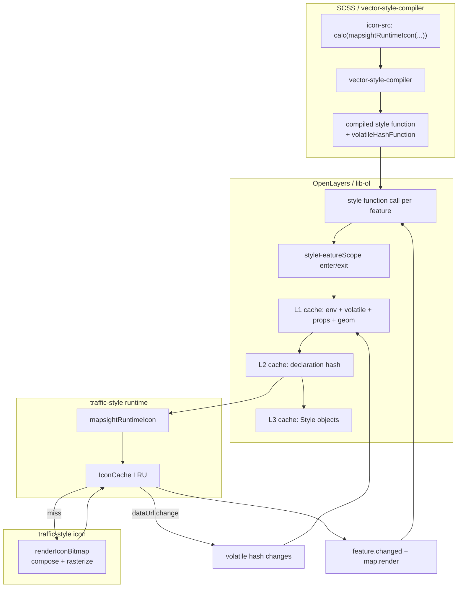

# Runtime icons

Runtime icons are **client-composed map icons**: pictograms (or short text labels) are
assembled into SVG, rasterized to PNG data URLs, cached, and wired into OpenLayers
style functions. Pre-baked sprite icons are a separate path — see
[ICON_CATALOG.md](ICON_CATALOG.md). For `@mapsight/ui` usage see the
[README](../README.md#icons-with-mapsightui); for standalone wiring see
[ICON_INTEGRATION.md](ICON_INTEGRATION.md).

This document explains:

- how icons are **formed** (`src/lib/icon/`)
- how they are **cached and accessed** at runtime (`src/lib/runtime/`)
- how that interacts with **`@mapsight/vector-style-compiler`** and
  **`createCachedStyleFunction`** from `@mapsight/lib-ol`

There are **two separate caches** involved. Keeping them straight is the key to
understanding the system.

---

## Two caches

| Cache                    | Where                                 | Key                                                           | What is stored                          |
| ------------------------ | ------------------------------------- | ------------------------------------------------------------- | --------------------------------------- |
| **Icon bitmap cache**    | `runtime/cache.ts` (`IconCache`)      | `mapsightIconId\|variant`                                     | Rasterized PNG `dataUrl` + dimensions   |
| **Style function cache** | `lib-ol/createCachedStyleFunction.ts` | env + props + geometry + **volatile hash** + declaration hash | Materialized OpenLayers `Style` objects |

The icon cache answers: “have we already drawn `museum/#be123c` at `small` size?”

The style cache answers: “for this feature at this zoom with these props, which
`Style` (including `icon-src`) did we already build?”

Runtime icons need **both**: the bitmap cache avoids re-rasterizing SVG; the style
cache avoids re-running the compiled style program. When a placeholder icon resolves
to a real data URL, the **volatile hash** changes so only affected features get
restyled.



---

## Package layout

### `src/lib/icon/` — how an icon is formed

Pure rendering pipeline. No map awareness, no React, no LRU beyond what callers pass in.

| Module         | Role                                                              |
| -------------- | ----------------------------------------------------------------- |
| `icon-id.ts`   | Compact `mapsightIconId` ↔ `IconSpec`, `resolveMapsightIconSpec`  |
| `compose.ts`   | Pictogram/label + template → SVG string                           |
| `resolve.ts`   | Default colors and variant                                        |
| `templates.ts` | Per-variant backgrounds and layout slots                          |
| `contrast.ts`  | Auto foreground for a background color                            |
| `rasterize.ts` | SVG → canvas → PNG data URL (browser DOM)                         |
| `render.ts`    | **`renderIconBitmap(spec)`** — single entry for the full pipeline |

Export: `@mapsight/traffic-style/icon` (and re-exported pieces via `runtime-dev`).

### `src/lib/runtime/` — how icons are cached and accessed

| Module          | Role                                                           |
| --------------- | -------------------------------------------------------------- |
| `icon-key.ts`   | Cache key: `` `${mapsightIconId}\|${variant}` ``               |
| `cache.ts`      | `IconCache` LRU + in-flight deduplication                      |
| `icon-load.ts`  | **Async access**: `loadIcon`, `getCachedIcon` (React UI)       |
| `icon-style.ts` | **Style access**: `mapsightRuntimeIcon` + map re-render wiring |
| `prewarm.ts`    | Optional catalog prewarm (dev tooling)                         |

Exports:

- **`@mapsight/traffic-style/runtime`** — production map + UI integration
- **`@mapsight/traffic-style/runtime-dev`** — inspection, parsing, prewarm, cache stats
- **`@mapsight/traffic-style/icon-style`** — direct import of `mapsightRuntimeIcon` (compiler alias)

---

## Compact `mapsightIconId`

Features store icons as a single string property:

```json
{ "mapsightIconId": "museum" }
{ "mapsightIconId": "museum/#be123c" }
{ "mapsightIconId": "museum/#be123c/#ffffff" }
{ "mapsightIconId": "P2/#035799" }
```

Format: `pictogramOrLabel[/background[/foreground]]`

- Colors are optional; omitted foreground is chosen via `pickContrastForeground`.
- **Variant is not part of the compact id** — it comes from the style rule (zoom
  band, highlight state, etc.).
- Cache key is always **`mapsightIconId|variant`** (see `icon-key.ts`).

Parse/format API (dev): `parseMapsightIcon`, `formatMapsightIcon` from `runtime-dev`.

---

## Two runtime access patterns

### 1. `icon-load` — async, wait for the bitmap

For React and other UI that can hold loading state:

```ts
import {getCachedIcon, loadIcon} from "@mapsight/traffic-style/runtime";

const cached = getCachedIcon("museum/#be123c", "plain");
const bitmap = await loadIcon("museum/#be123c", "plain");
// bitmap.dataUrl → use in 
```

`useMapsightIcon` in `@mapsight/ui` is a thin wrapper around this.

Flow:

1. `loadIcon` → `IconCache.get`
2. On miss → `resolveMapsightIconSpec` → `renderIconBitmap` → store in LRU
3. Caller awaits the promise; no map involved

### 2. `icon-style` — sync placeholder, deferred map update

For OpenLayers style functions that **must return immediately**:

```ts
import {mapsightRuntimeIcon} from "@mapsight/traffic-style/runtime";
```

Used from compiled CSS like:

```css
icon-src: calc(mapsightRuntimeIcon(attr(mapsightIconId), "default"));
```

`mapsightRuntimeIcon` behavior:

1. **Cache hit** → return `dataUrl` synchronously
2. **Cache miss** → return `RUNTIME_ICON_PLACEHOLDER_SRC` (1×1 transparent PNG),
   register the current feature as “pending”, start `IconCache.get` in the background
3. When rasterization finishes → `feature.changed()` + schedule `map.render()` on all
   registered map callbacks

The style function cannot block on canvas rasterization; the placeholder + re-render
pattern is intentional.

#### Map render callbacks (multiple maps)

```ts
import {addRuntimeIconMapRenderCallback} from "@mapsight/traffic-style/runtime";

const remove = addRuntimeIconMapRenderCallback(() => map.render());
// later: remove()
```

Each map instance registers its own callback. `scheduleMapRender` coalesces multiple
icon resolutions into **one deferred `requestAnimationFrame`**, then invokes **every**
registered callback once.

The `@mapsight/ui` plugin `createRuntimeIconStylePlugin` calls
`addRuntimeIconMapRenderCallback` per map controller.

#### Feature scope (which feature gets `changed()`)

`createCachedStyleFunction` wraps each style evaluation:

```ts
const exit = enterStyleFeatureScope(feature);
// … evaluate declarations, including mapsightRuntimeIcon …
exit();
```

`bindRuntimeIconStyleFeatureScope` registers hooks so `mapsightRuntimeIcon` knows
which OpenLayers feature received a placeholder. When that icon’s cache key resolves,
`notifyIconResolved` calls `feature.changed()` on all features that were waiting for
that key.

`lib-ol`’s `addStyleFeatureScopeHooks` supports **multiple hook sets** (e.g. several
plugins or style function bundles). Each registration adds another enter/exit pair;
all run for every feature styled.

---

## Icon bitmap cache (`IconCache`)

Implementation: `runtime/cache.ts`

- **LRU** (`lru-cache`, default max 512 entries)
- **In-flight deduplication**: concurrent requests for the same key share one promise
- **Key**: `mapsightIconCacheKey(mapsightIconId, variant)` → `"museum|small"`
- **Miss path**: `resolveMapsightIconSpec` → `renderIconBitmap` → store `IconBitmap`

`IconBitmap` includes the data URL, physical pixel size, logical template size, and
the cache key string.

Dev helpers: `defaultIconCache.getStats()`, `prewarmCatalog()` via `runtime-dev`.

---

## vector-style-compiler integration

### Declaring runtime icons in SCSS

`src/scss/features/_base.scss`:

```scss
[mapsightIconId] {
	icon-src: calc(mapsightRuntimeIcon(attr(mapsightIconId), "default"));
}
// zoom bands use "xsmall" and "small" variants
```

`@include auto-icon.autoIcon("default")` overrides known **sprite** ids back to the
sprite sheet. Everything else stays on the runtime path.

### Volatile `calc()` helpers

`mapsightRuntimeIcon` is registered in `vector-style-compiler` as a **volatile**
helper (`volatileCalcHelpers.ts`). Its return value can change **without** feature
props or map env changing (placeholder → real URL).

When the compiler sees:

```css
icon-src: calc(mapsightRuntimeIcon(attr(mapsightIconId), "default"));
```

it:

1. Emits a normal **declaration** that calls `mapsightRuntimeIcon(...)` for `icon-src`
2. Emits a **`volatileHashFunction`** that also calls `mapsightRuntimeIcon(...)` and
   folds the result into a hash
3. Adds `import { mapsightRuntimeIcon } from '@mapsight/traffic-style/runtime'`

If the stylesheet has **no** volatile calcs, `volatileHashFunction` is still emitted
but returns `createHash([])` (no extra invalidation).

Relevant compiler tests: `volatileHashCompile.test.ts`, `runtimeIconCompile.test.ts`.

---

## `createCachedStyleFunction` — style cache levels

Compiled style functions use `@mapsight/lib-ol`’s 3-level LRU cache.

### Level 1 (coarse)

```
cacheHashL1 = envHash | volatileHash | geometryType | propsHash
```

**`volatileHash`** is the critical piece for runtime icons. It is computed on every
style call and includes the **current string returned by `mapsightRuntimeIcon`**.
When that string changes from placeholder to data URL, L1 misses for that feature
even if props and zoom are unchanged.

### Level 2 (declaration)

```
cacheHashL2 = declarationHashFunction(...) | volatileHash
```

Caches the result of running the compiled declaration tree (which CSS rules matched).

### Level 3

Caches constructed OpenLayers style instances (clone per derived geometry).

### End-to-end timeline (first paint → resolved icon)

1. Map renders; style function runs for feature with `mapsightIconId: "museum"`.
2. `enterStyleFeatureScope(feature)` — runtime icon hook records active feature.
3. `volatileHashFunction` runs → `mapsightRuntimeIcon("museum", "default")` →
   placeholder URL → hash **P**
4. Declaration runs → same call → `icon-src` = placeholder
5. L1/L2 miss (first time) → Style materialized with placeholder image
6. `IconCache.get` completes asynchronously
7. `notifyIconResolved`:
    - `feature.changed()` — marks feature stale
    - `scheduleMapRender()` — `map.render()` on next frame
8. Style function runs again; `mapsightRuntimeIcon` returns **data URL** → hash **D**
9. `volatileHash` changed (P → D) → **L1 miss** → new Style with real icon
10. Subsequent frames: cache hit at both icon and style levels

Only features that actually received a placeholder for that cache key are notified.
The volatile hash ensures the rest of the map is not fully restyled on every icon load.

---

## Application wiring

### Mapsight UI (production)

`packages/ui/src/js/plugins/common/runtime-icon-style.ts`:

```ts
bindRuntimeIconStyleFeatureScope(addStyleFeatureScopeHooks);

addRuntimeIconMapRenderCallback(() => {
	mapController.getMap()?.render();
});
```

Install via `createRuntimeIconStylePlugin` in browser defaults. Without this plugin,
icons may rasterize but the map will not pick up the resolved data URLs.

### React feature lists

```ts
import {useMapsightIcon} from "@mapsight/ui/hooks/useMapsightIcon";

const {src, loading} = useMapsightIcon(mapsightIconId, "plain");
```

Uses `icon-load` (`loadIcon` / `getCachedIcon`), not `mapsightRuntimeIcon`.

---

## Variants

| Variant   | Typical use              | Template shape                 |
| --------- | ------------------------ | ------------------------------ |
| `default` | Zoom ≥ default threshold | 40×40 rounded square           |
| `small`   | Mid zoom band            | 28×28 circle                   |
| `xsmall`  | Low zoom                 | 22×22 circle                   |
| `plain`   | Lists, UI chrome         | 34×34 square, plain background |

Variant is selected in SCSS (zoom selectors), not in `mapsightIconId`.

---

## Testing

Run unit tests with `pnpm test` in this package.

| Area                                            | Location                                                               |
| ----------------------------------------------- | ---------------------------------------------------------------------- |
| Icon formation (compose, parse, rasterize prep) | `src/lib/icon/*.test.ts`                                               |
| Runtime cache + style notify                    | `src/lib/runtime/icon-style.test.ts`                                   |
| Multi-map + multi-style-function notify         | `src/lib/runtime/icon-style.test.ts`                                   |
| Compiler volatile hash emission                 | `packages/vector-style-compiler/__tests__/volatileHashCompile.test.ts` |

---

## Quick reference — exports

| Import path                           | Use                                           |
| ------------------------------------- | --------------------------------------------- |
| `@mapsight/traffic-style/runtime`     | Map + UI production API                       |
| `@mapsight/traffic-style/runtime-dev` | Dev tools, parsing, prewarm, stats            |
| `@mapsight/traffic-style/icon`        | Icon formation pipeline only                  |
| `@mapsight/traffic-style/icon-style`  | Direct `mapsightRuntimeIcon` (compiler alias) |
