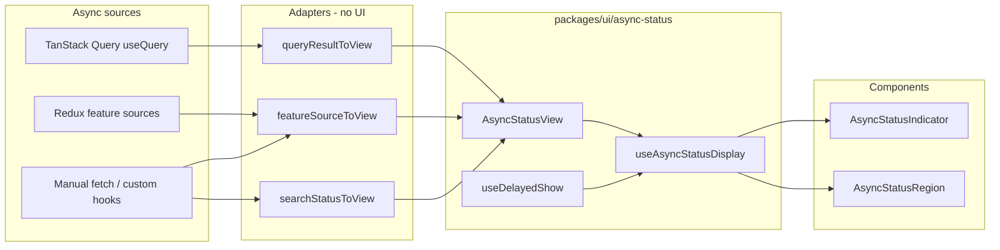
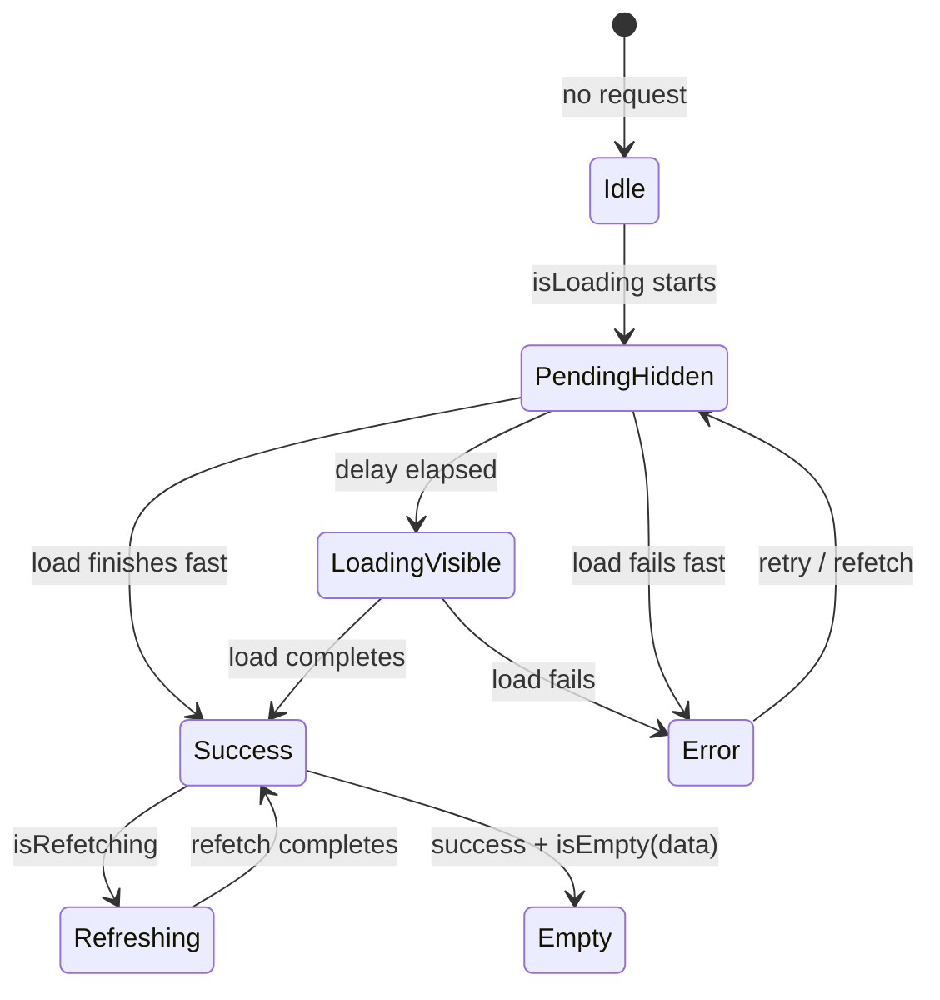

# Async status / loading UI (`@mapsight/ui`)

Universal loading, error, empty, and refresh presentation for Mapsight UI.

**Principle:** TanStack Query (and Redux feature sources) own async _state_;
`@mapsight/ui` owns async _presentation_.

Related direction: [ADR 005 — fetch and TanStack Query](https://github.com/open-mapsight/mapsight/blob/main/docs/architecture/decisions/005-fetch-and-tanstack-query-over-axios.md).

## Exports

| Import                                 | Purpose                                                                          |
| -------------------------------------- | -------------------------------------------------------------------------------- |
| `@mapsight/ui/async-status`            | View model, hooks, adapters (`featureSourceToView`, `searchStatusToView`), types |
| `@mapsight/ui/async-status/components` | `AsyncStatusRegion`, `AsyncStatusIndicator` (replaceable)                        |
| `@mapsight/ui/react-query`             | `queryResultToView`, `useQueryStatusDisplay`, `QueryStatusRegion`                |

`@tanstack/react-query` is an **optional peer** of `@mapsight/ui`. Apps without Query use the first two subpaths only.

### TanStack Query example

```tsx
import {QueryStatusRegion} from "@mapsight/ui/react-query";
import {useQuery} from "@tanstack/react-query";

function StationsPanel() {
	const query = useQuery({queryKey: ["stations"], queryFn: fetchStations});

	return (
		<QueryStatusRegion
			query={query}
			loadingMessage="Loading stations…"
			emptyMessage="No stations found."
		>
			<StationList stations={query.data ?? []} />
		</QueryStatusRegion>
	);
}
```

## Layering



## TanStack Query alignment

Use TanStack Query v5 flag semantics verbatim. Reference: [Background fetching indicators](https://tanstack.com/query/v5/docs/framework/react/guides/background-fetching-indicators), [Queries guide](https://tanstack.com/query/v5/docs/framework/react/guides/queries).

| Concept                      | TanStack Query                                               | Mapsight display rule                              |
| ---------------------------- | ------------------------------------------------------------ | -------------------------------------------------- |
| No data yet                  | `status === 'pending'` / `isPending`                         | Candidate for initial placeholder (after delay)    |
| First fetch running          | `isLoading` (= `isPending && isFetching`)                    | **Show initial spinner** (when query is enabled)   |
| Any fetch running            | `isFetching` / `fetchStatus === 'fetching'`                  | Background activity                                |
| Refetch with data            | `isRefetching` (= `isFetching && !isPending`)                | Subtle refresh indicator; keep children visible    |
| Failed                       | `status === 'error'` / `isError`                             | Error UI immediately (no delay)                    |
| Success, no items            | `isSuccess` + empty data                                     | Empty message (not loading)                        |
| Paused / offline             | `fetchStatus === 'paused'`                                   | Optional “waiting for network” copy; not a spinner |
| Stale data during key change | `placeholderData` / `keepPreviousData` / `isPlaceholderData` | Treat as success + refetching                      |

### `isPending` vs `isLoading`

- Use **`isPending`** for TypeScript narrowing (`data` may be undefined).
- Use **`isLoading`** for **spinner visibility** on enabled queries — avoids showing a spinner when `enabled: false` (`isPending: true`, `isFetching: false`).

TanStack Query does **not** provide delayed loading indicators. Mapsight UI adds `useDelayedShow` on top.

## Normalized view model

All adapters produce the same shape:

```ts
type AsyncFetchStatus = "fetching" | "paused" | "idle";

type AsyncStatusView<T> = {
	status: "pending" | "error" | "success";
	fetchStatus: AsyncFetchStatus;
	data: T | undefined;
	error: unknown;
	isPlaceholderData?: boolean;
	refetch?: () => void;
};
```

Derived flags (computed in `useAsyncStatusDisplay`, not stored):

```ts
const isLoading = status === "pending" && fetchStatus === "fetching";
const isRefetching = fetchStatus === "fetching" && status !== "pending";
const isPaused = fetchStatus === "paused";
```

## Display state machine



| Display phase | Condition                                                                                 | UI                                        |
| ------------- | ----------------------------------------------------------------------------------------- | ----------------------------------------- |
| `hidden`      | Initial load, delay not elapsed                                                           | Render nothing (`AsyncStatusRegion` is `null`) |
| `loading`     | `showInitialLoading` (delayed `isLoading`)                                                | Full placeholder spinner + message        |
| `error`       | `status === 'error'` and no stale data (or `errorWithStaleData: "replace"`)               | Error block + retry if `refetch` provided |
| `empty`       | `status === 'success'` && empty data                                                      | Empty message                             |
| `refreshing`  | `isRefetching` && has content, or `status === 'error'` with stale data and default banner | Children + subtle badge/bar               |
| `content`     | `status === 'success'` && has data                                                        | Children only                             |

### Delay rules

| Signal                        | Delay?                          |
| ----------------------------- | ------------------------------- |
| Initial loading (`isLoading`) | Yes — default 300ms             |
| Error                         | No — immediate                  |
| Refetching                    | No — immediate subtle indicator |
| Empty                         | No                              |

Optional **min visible** duration (default 200ms): once the spinner is shown, keep it visible briefly to avoid blink when load completes just after delay.

Defaults used by the hooks today:

```ts
const DEFAULT_ASYNC_STATUS_OPTIONS = {
	delayMs: 300,
	minVisibleMs: 200,
	showRefreshIndicator: true,
	errorWithStaleData: "banner" as const,
};
```

## Adapters

### Redux feature source → `AsyncStatusView`

Maps `@mapsight/core` feature-source state via `featureSourceToView` in
`@mapsight/ui/async-status`.

Feature list edge cases:

| Case                                      | Behavior                                                    |
| ----------------------------------------- | ----------------------------------------------------------- |
| No feature source selected                | Not async loading — keep “no list selected”                 |
| Filter yields zero results, source loaded | `empty`, not loading                                        |
| Error with stale data                     | Default: banner over list if data exists; full error if not |
| Autoload via `useAutoloadFeatureSource`   | Unchanged; view reflects resulting source state             |

### TanStack Query → `AsyncStatusView`

Thin mapper in `@mapsight/ui/react-query` — no reimplementation of Query logic:

```ts
function queryResultToView<T>(query: UseQueryResult<T>): AsyncStatusView<T> {
	return {
		status: query.status,
		fetchStatus: query.fetchStatus,
		data: query.data,
		error: query.error,
		isPlaceholderData: query.isPlaceholderData,
		refetch: () => {
			void query.refetch();
		},
	};
}
```

## Package boundaries

| Export                      | Dependency on `@tanstack/react-query` |
| --------------------------- | ------------------------------------- |
| `@mapsight/ui/async-status` | **None**                              |
| `@mapsight/ui/react-query`  | Optional peer                         |

Demo apps without Query must not require it. Apps that already use Query
(e.g. `@mapsight/count-aggregator-ui`, showcase) import the adapter subpath.

## Customization

1. **CSS custom properties** — `--ms3-async-status-min-height`, spinner size, etc.
2. **i18n** — generic + context-specific keys (e.g. `ui.feature-list.loading`).
3. **Props** — `loadingMessage`, `errorMessage`, `variant`, `delayMs`.
4. **`ComponentsContext`** — replace `AsyncStatusRegion` / `AsyncStatusIndicator` via `makeReplaceableComponent`.
5. **Host SCSS** — override variables on containers (e.g. full-height panel placeholders).

## Future: feature sources on Query

Presentation components stay stable when feature-source fetching migrates to TanStack Query:

- `keepPreviousData` / `placeholderData` on module or layer key changes
- `QueryClient` defaults at the app shell
- Optional `useIsFetching` for a global subtle indicator

Adapters already allow incremental migration without changing the region/indicator APIs.
